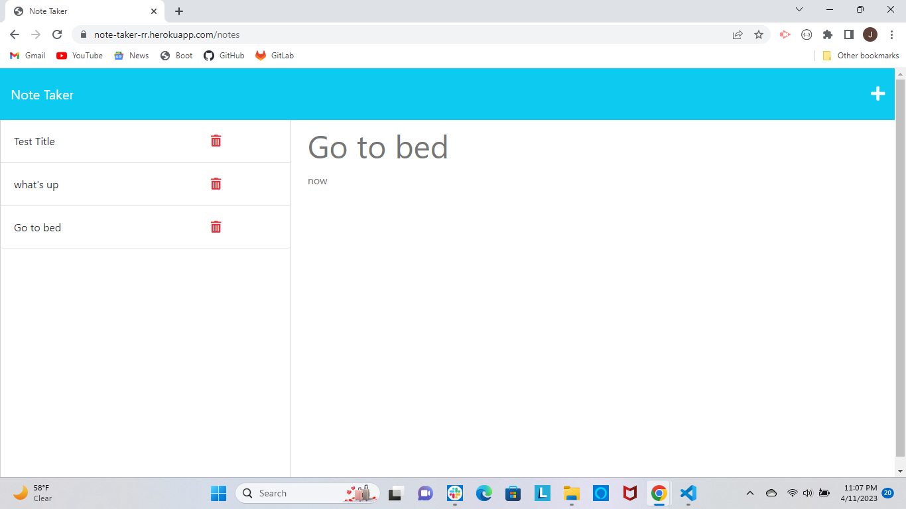

# Description 
With the help of Express.js, the application facilitates the storage and retrieval of notes for organizational purposes. Users can write and save their notes, which are stored in a JSON file on the back end.

# Table of Contents 
Installation 
Usage
License 

# Installation 
To install the necessary dependencies for the application, use the command: "npm install". This command will install both the express and uniqid packages.

# Usage
After deploying the application with Heroku, you can easily add a new note to the list by entering the note title and text on the notes page, then clicking on the save icon located in the top-right corner. Removing a note is also simple - just click on the trashcan icon next to the desired note on the list.

# Deployed Link
https://note-taker-rr.herokuapp.com/notes

# Mock up

# License 
This application is licensed by the MIT license.